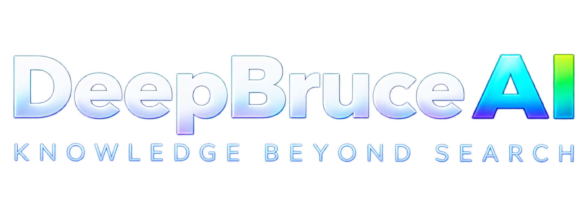
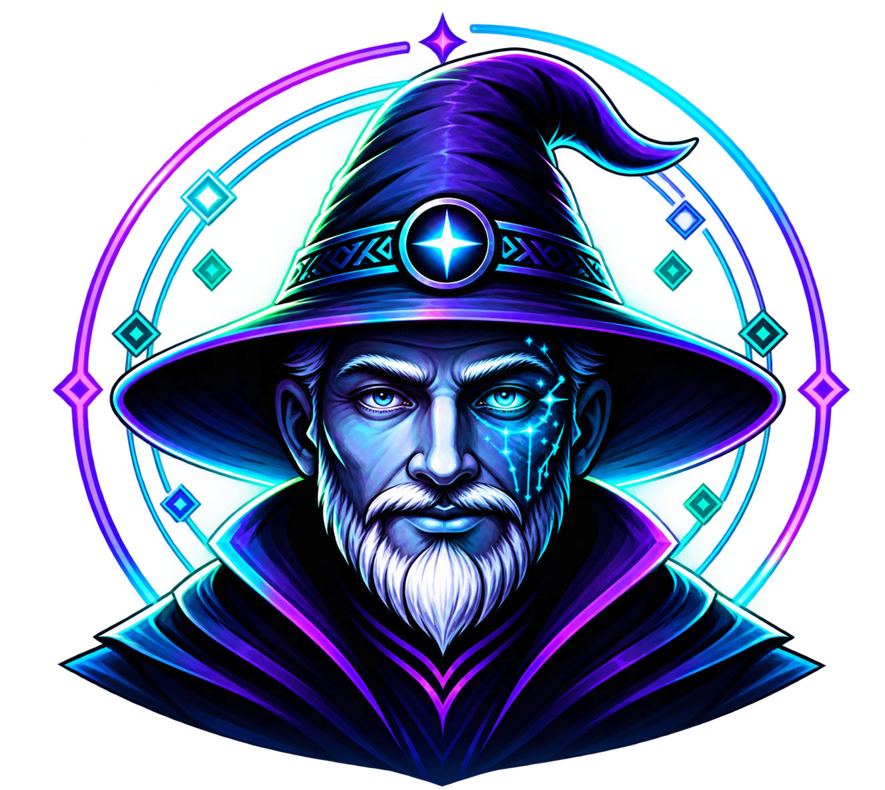
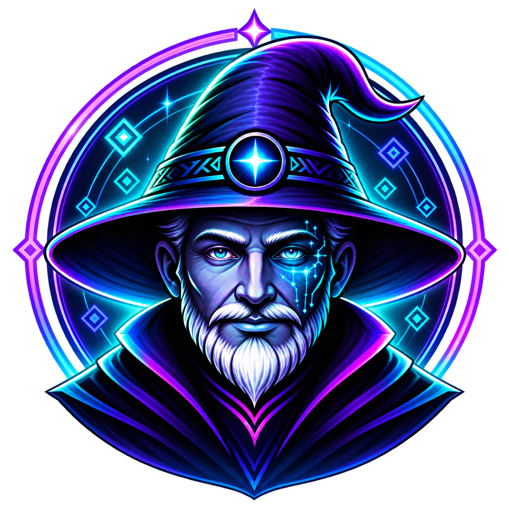
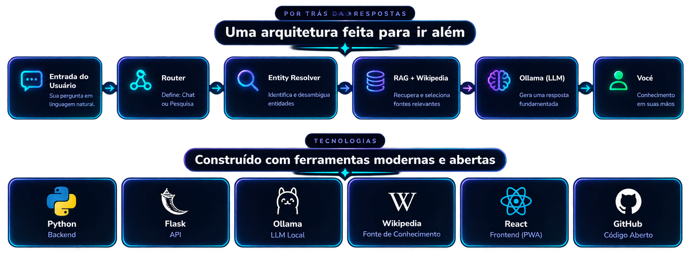

<p align="center">
  
</p>

<p align="center">
  <strong>Knowledge Beyond Search.</strong><br/>
  Um assistente de pesquisa com personalidade própria, RAG com Wikipédia, streaming SSE e uma interface React construída para parecer um portal — não só mais um chatbot.
</p>

<p align="center">
  <a href="https://deepbruce-ai.pages.dev/"><strong>🧙‍♂️ Abrir DeepBruce AI</strong></a>
  ·
  <a href="https://deepbruce-api.onrender.com/health">API Health</a>
  ·
  <a href="#-executando-localmente">Executar localmente</a>
  ·
  <a href="#-arquitetura">Arquitetura</a>
</p>

<p align="center">
  
  
  
  
  
  
</p>

---

<p align="center">
  
</p>

## ✨ O que é o DeepBruce?

O **DeepBruce AI** é um assistente de conhecimento que combina conversa natural, pesquisa assistida por RAG e uma identidade visual própria.

Ele pode responder diretamente por um LLM ou, quando a pergunta pede pesquisa, consultar a **Wikipédia**, identificar entidades, recuperar trechos relevantes e gerar uma resposta fundamentada. Tudo chega ao frontend em **streaming via SSE**, token por token.

A proposta da v1.5 é simples:

> **fazer a experiência parecer mágica sem sacrificar clareza, precisão ou engenharia.**

O DeepBruce fala português, inglês e espanhol, possui uma personalidade de mago sutil e alterna entre conversa, pesquisa e esclarecimento de ambiguidades.

---

## 🚀 Experimente agora

### 🌐 Aplicação
**https://deepbruce-ai.pages.dev/**

### ❤️ Health check da API
**https://deepbruce-api.onrender.com/health**

> O backend está hospedado no plano gratuito do Render. Após um período sem uso, o primeiro acesso pode levar alguns segundos enquanto o serviço acorda.

---

## 🧠 Principais recursos

- 🗣️ **Conversa natural** com respostas em streaming.
- 📚 **RAG com Wikipédia** para perguntas de pesquisa.
- 🧭 **Message Router** que separa chat, pesquisa e mensagens ambíguas.
- 🔎 **Entity Resolver** para nomes, erros de digitação e entidades incompletas.
- ❓ **Clarification Flow** em casos como “Quem é o Justin?”.
- 🌍 **Multilíngue**: PT, EN e ES.
- 🧙 **Persona própria**: mística, serena e objetiva, sem transformar toda resposta em teatro.
- 📝 **Markdown no chat**, incluindo blocos de código.
- 🎙️ **Voice Lite** usando APIs do navegador quando disponíveis.
- 🌙 **Dark / Light mode**.
- ♻️ **New Chat** com reset real do estado da conversa.
- ✨ **Background cósmico em CSS**, com animações respeitando `prefers-reduced-motion`.
- 🛡️ **Limite de tamanho de mensagem** na API.
- 🧪 **CI com backend + frontend**.
- 🐳 **Docker** para o backend e ambiente local com Ollama.

---

## 🪄 Experiência visual

<p align="center">
  
</p>

A interface da v1.5 foi desenhada em torno da identidade do próprio Bruce: azul profundo, violeta, ciano, estrelas, mapas e uma estética de fantasia tecnológica.

O chat utiliza um avatar próprio:

<p align="center">
  
</p>

E a seção de arquitetura foi transformada em parte da experiência visual:

<p align="center">
  
</p>

---

## 🏗️ Arquitetura

### Produção

```text
Browser
   │
   ▼
Cloudflare Pages
React + Vite
   │
   │ HTTPS / SSE
   ▼
Render
Flask + Gunicorn
   │
   ├── Chat ──────────────────────────────► Ollama Cloud
   │
   ├── Research
   │      │
   │      ▼
   │   Entity Resolver
   │      │
   │      ▼
   │   Wikipedia
   │      │
   │      ▼
   │   RAG / Retrieval
   │      │
   │      ▼
   └──────────────────────────────────────► Ollama Cloud
```

### Roteamento interno

```text
Mensagem
   │
   ▼
Message Router
   ├── chat ─────────► Ollama Core
   ├── research ─────► Entity Resolver ─► Wikipedia ─► RAG ─► Ollama
   └── ambiguous ────► Clarification Flow
```

A v1.5 mantém o `ConversationManager` **em memória**. Por isso, o Gunicorn roda com **1 worker** para preservar consistência de estado entre mensagens. Persistência compartilhada fica para a v2.

---

## 🧰 Stack

| Camada | Tecnologia |
|---|---|
| Frontend | React 19 + Vite |
| Backend | Python 3.12 + Flask |
| Streaming | Server-Sent Events (SSE) |
| LLM | Ollama local / Ollama Cloud |
| RAG | Wikipédia + retrieval híbrido |
| NLP / Retrieval | BM25, TF-IDF, stemming e deduplicação |
| Parsing | BeautifulSoup |
| Deploy frontend | Cloudflare Pages |
| Deploy backend | Render |
| Container | Docker / Docker Compose |
| CI | GitHub Actions |
| Testes | Pytest + ESLint + Vite build |

---

## 💻 Executando localmente

### 1. Clone o projeto

```bash
git clone https://github.com/lucasalencarxisto-stack/DeepBruce-AI.git
cd DeepBruce-AI
```

### 2. Backend Python

Crie e ative o ambiente virtual:

```bash
python -m venv .venv
source .venv/bin/activate
```

No Windows fora do WSL:

```powershell
.venv\Scripts\activate
```

Instale as dependências:

```bash
python -m pip install --upgrade pip
python -m pip install -r requirements-dev.txt
```

### 3. Configure o `.env`

Crie um arquivo `.env` na raiz:

```dotenv
OLLAMA_HOST=http://127.0.0.1:11434
OLLAMA_MODEL=gemma3:1b
OLLAMA_API_KEY=

OLLAMA_CONNECT_TIMEOUT=5
OLLAMA_READ_TIMEOUT=300

PORT=8000
OQS_NAMESPACE=default
CORS_ORIGINS=http://localhost:5173
MAX_MESSAGE_LENGTH=4000
```

> Nunca commite chaves de API. O repositório já ignora arquivos `.env`.

### 4. Ollama local

Com o Ollama instalado:

```bash
ollama pull gemma3:1b
ollama serve
```

Em outro terminal:

```bash
python wsgi.py
```

API:

```text
http://127.0.0.1:8000
```

Health check:

```text
http://127.0.0.1:8000/health
```

### 5. Frontend

```bash
cd frontend
npm ci
npm run dev
```

O Vite normalmente sobe em:

```text
http://localhost:5173
```

Em desenvolvimento, o Vite encaminha `/api` para o Flask local.

---

## ☁️ Usando Ollama Cloud

A mesma aplicação também suporta Ollama Cloud através de variáveis de ambiente:

```dotenv
OLLAMA_HOST=https://ollama.com
OLLAMA_MODEL=<modelo-cloud>
OLLAMA_API_KEY=<sua-chave>
```

Nenhuma chave fica no frontend. As credenciais de produção devem ser configuradas apenas no provedor do backend.

---

## 🐳 Docker

Para subir backend + Ollama localmente:

```bash
docker compose --profile dev up --build
```

O Compose cria a rede interna e usa:

```text
http://ollama:11434
```

como host do Ollama dentro dos containers.

Para validar apenas a imagem de produção:

```bash
docker compose --profile prod build app
```

---

## 🧪 Qualidade

### Backend

```bash
python -m pytest -q
```

A suíte cobre, entre outros pontos:

- roteamento;
- SSE;
- chat;
- RAG;
- resolução de entidades;
- ambiguidades;
- limite de tamanho de mensagem;
- comportamento do Ollama com mocks;
- conversation reset.

### Frontend

```bash
cd frontend
npm run lint
npm run build
```

A CI executa automaticamente:

```text
pytest
npm ci
npm run lint
npm run build
```

---

## 🔐 Decisões da v1.5

A v1.5 Beta prioriza uma arquitetura simples, demonstrável e fácil de estudar.

Por isso:

- o estado das conversas ainda é mantido em memória;
- o backend roda com um worker Gunicorn;
- Redis/banco compartilhado ainda não fazem parte desta versão;
- autenticação obrigatória não foi adicionada;
- o limite padrão de mensagens é de 4000 caracteres;
- o RAG usa Wikipédia como fonte principal.

Essas decisões são intencionais e mantêm o projeto pequeno o suficiente para ser compreendido de ponta a ponta.

---

## 🔮 V2 Vision

A própria aplicação possui uma página **V2 Vision** com ideias que ficam fora do escopo da v1.5.

Entre elas:

- voz natural STT → IA → TTS;
- avatar reativo;
- memória persistente;
- Redis / banco compartilhado;
- experimentos com SLM / Transformer próprio;
- cliente nativo;
- métricas de avaliação de IA.

> **V1.5 gives Bruce a mind. V2 gives Bruce a presence.**

---

## 📁 Estrutura resumida

```text
DeepBruce-AI/
├── DeepBruce_AI/
│   ├── routes/
│   ├── services/
│   └── config.py
├── frontend/
│   ├── public/
│   └── src/
├── tests/
├── Dockerfile
├── docker-compose.yml
├── requirements.txt
├── requirements-rag.txt
├── requirements-dev.txt
└── wsgi.py
```

---

## 🤝 Sobre o projeto

O DeepBruce nasceu como um projeto de estudo e evoluiu para um laboratório prático de:

**Python · Flask · React · APIs · SSE · RAG · NLP · Docker · CI/CD · Cloud · IA local e cloud**

O objetivo não é esconder a complexidade atrás de uma interface bonita. É justamente o contrário: construir uma experiência bonita **sem deixar de entender o que existe por trás dela**.

---

## ⚠️ Aviso

Este é um projeto independente, educacional e experimental.

**DeepBruce AI não possui afiliação com OpenAI, Wikipédia/Wikimedia Foundation, Ollama, Cloudflare ou Render.**

---

<p align="center">
  <strong>DeepBruce AI v1.5 Beta</strong><br/>
  <em>Mesmas perguntas. Uma perspectiva mais profunda.</em>
</p>
